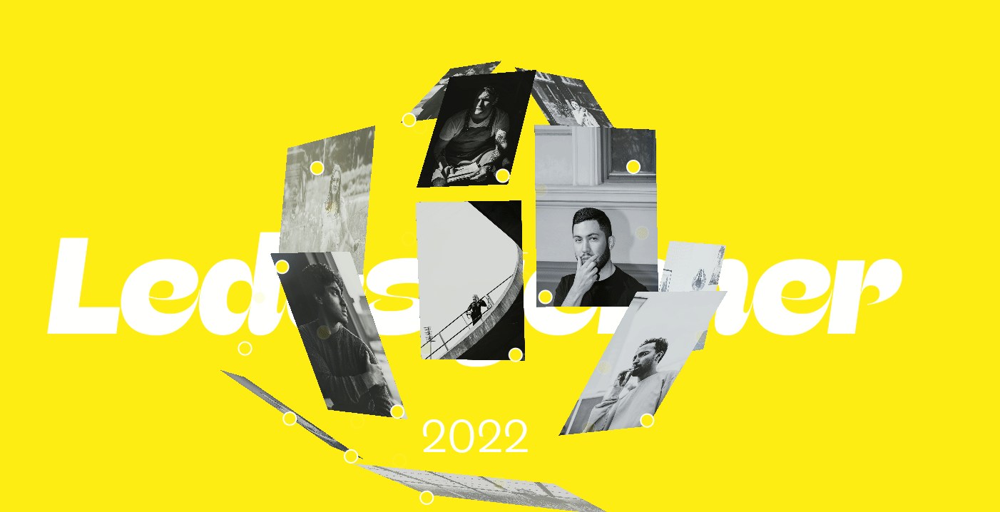

# Viatge a l'espai

- Queremos hacer un homenaje a "L'espai de les oportunitats de Sta Coloma de Gramanet". Para ello vamos a construir **Viatge a L'Espai**, un proyecto de web interactiva que presentará las acciones que ha llevado a cabo "L'espai de les Oportunitats" así como testimonios de personas que han pasado por aquí. 

El punto de partida será una esfera de imágenes que enlazarán a escenarios 3d, de temáticas diferentes:
- Unos contarán con un avatar que nos represente y que contará quienes somos y que hemos obtenido de l'espai durante el tiempo que hemos compartido. Podríamos enlazar también a los proye
- Otros tendrán escenas que simbolicen alguna de las acciones que ha llevado a cabo l'espai o, en su defecto, el Servei de Convivència, Desenvolupament Comunitari i Civisme.

Trabajeremos tod@s junt@s en el mismo proyecto pero en ramas separadas que no se fusionarán hasta el final. 
El punto de inicio será la estructura vacía del proyecto. 

- La idea de la homepage comienza aquí: 
    
    

Web de referencia: https://www.dn.no/d2/ledestjerner/ledestjerne/2022/ledestjerner-2022-30-under-30/7-1-kerobndgm6

Temas del Servei de Convivència, Desenvolupament Comunitari i Civisme

- [Construint convivència](https://www.gramenet.cat/ajuntament/arees-municipals/servei-de-convivencia-desenvolupament-comunitari-i-civisme/el-relat-de-la-intervencio-construint-la-convivencia/)

- [Mediació i suport a les comunitats de veïnes i veïns](https://www.gramenet.cat/ajuntament/arees-municipals/servei-de-convivencia-desenvolupament-comunitari-i-civisme/equip-de-mediacio-i-suport-a-les-comunitats-de-veins-i-veines/)

- [Enfocament Restauratiu](https://www.gramenet.cat/ajuntament/arees-municipals/servei-de-convivencia-desenvolupament-comunitari-i-civisme/enfocament-restauratiu/)

- [Viu el Fondo](https://www.gramenet.cat/ajuntament/arees-municipals/servei-de-convivencia-desenvolupament-comunitari-i-civisme/projecte-viu-el-fondo/)

La Home Page tendrá los logos y colores del espai.
Páginas mezcladas de cada uno + de las temáticas.

Tiempo: 2 semanas.

Involucraremos a los educadores como stakeholders para alimentar las secciones propuestas. 

Si fuera posible haríamos versión ar para móvil.

